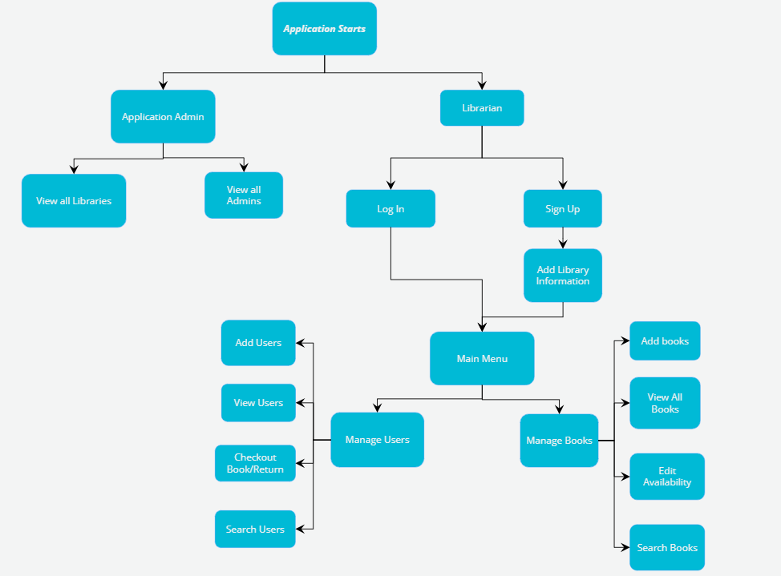
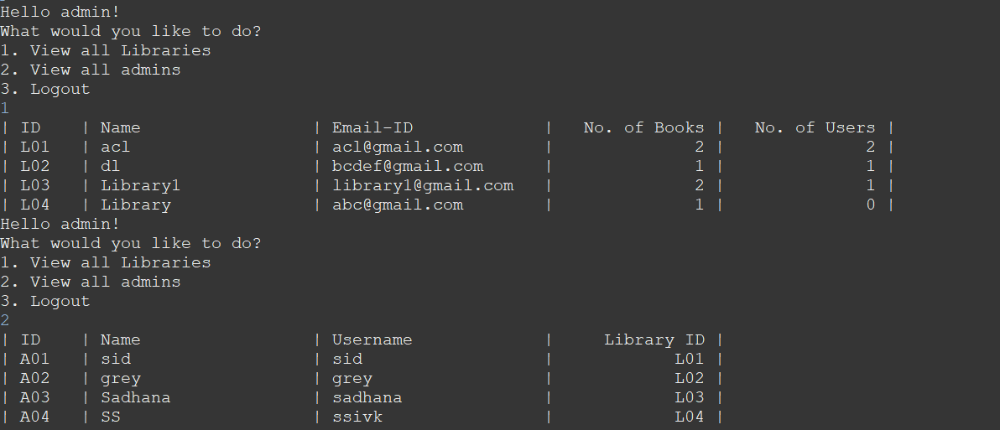
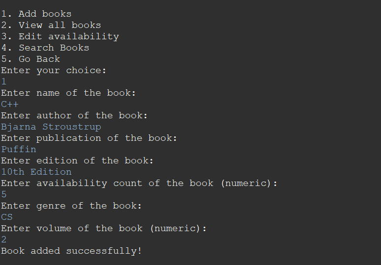
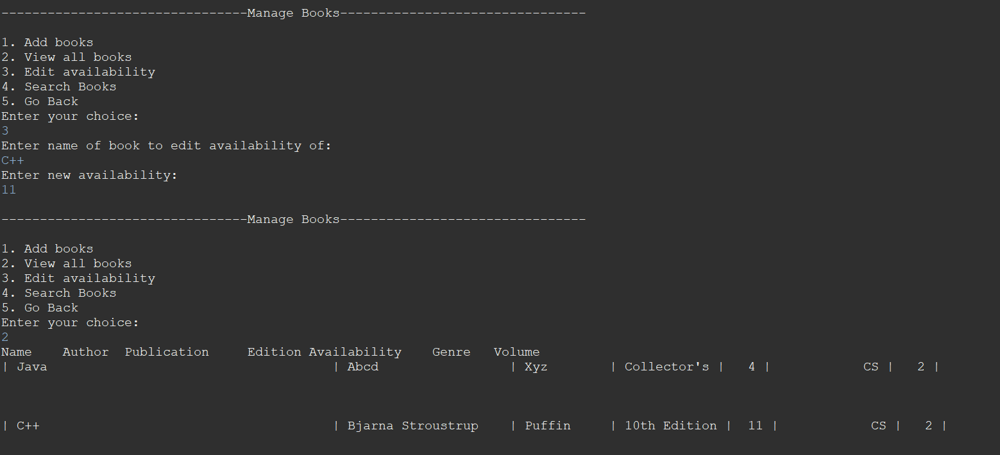
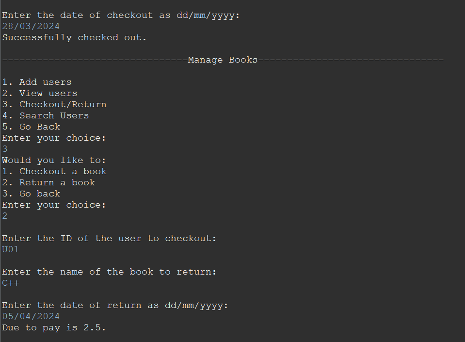

# Library-Management-2024
## About the Project
- Type: B2B
- Target Audience: Librarians, library admins
- This project is a console application made entirely from Java. It is aimed towards librarians and library admins in order to ease their work. This project helps the librarians/library admins store user data, log the borrowing records/return records of users, add books, check and manage the existing books, etc. It is a simple application where multiple libraries can simultaneously store, view and edit their records. 

## Built With
- Java
- JSON to store data

## Usage
Given below is the flow of the application.

